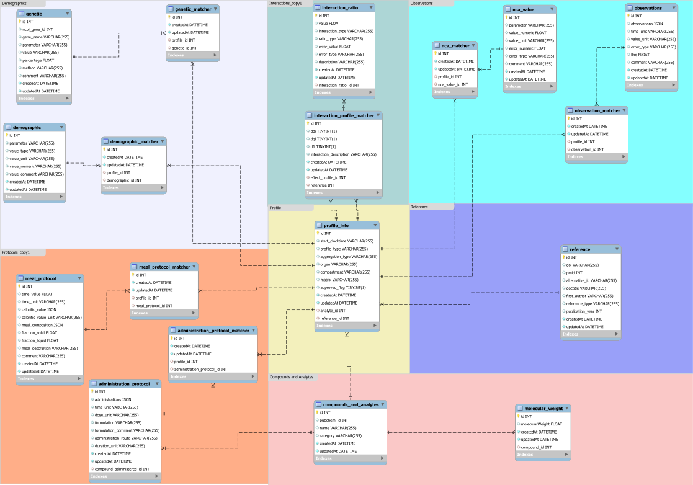

# README

This is the remote repository for the EraCoSysMed DDGI observed data database.
The database can be accessed via a REST API.


Schema for the database, last updated 04/14/2022.

# Technologies
The database is powered by mysql and was modeled using the sequelize ORM.
The REST API is developed in NODE.JS using EXPRESS.JS for routing. 

# Input validation

For the full documentation of the user input validation [start here](./docs/validation/_profile.md).
jsonschema2md can be run with 
```jsonschema2md -d server/validation/schemas -o docs/validation```


# Running the database locally

To run the database locally, please refer to the [documentation](./docs/running_locally/README.md).
