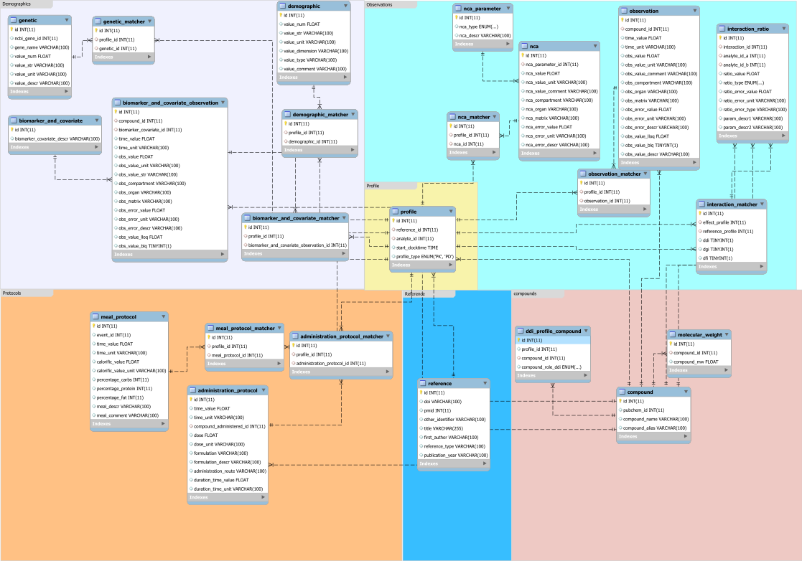

# Table of Contents
## [About](#about)

## [Input Validation](#input-validation)

## [Running the database locally](#running-the-database-locally)

# About

This is the remote repository for the EraCoSysMed DDGI observed data database.

Schema for the database, last updated 07/14/2021.



# Input validation

User input is validated using [JSON-schema draft-07](http://json-schema.org/draft-07/schema). 
<!-- For the full documentation of the user input validation [click here](./docs/README.md). -->
The input is required to have the following structure and data types:
```json
   {
     "profile_info": "object",
     "reference_info": "object",
     "compound_infos": "array",
     "drug_administrations": ["array", "null"],
     "demographic_infos": ["array", "null"],
     "genetic_infos": ["array", "null"],
     "observations": ["array", "null"],
     "biomarkers_and_covariates": ["array", "null"],
     "nca_values": ["array", "null"],
     "interaction_ratios": ["array", "null"]
   }
```
For specific details, please refer to the documentation:
- [profile_info](./docs/profile_info.md)
- [reference_info](./docs/reference_info.md)
- [compound_infos](./docs/compound_infos.md)
- [drug_administrations](./docs/drug_administrations.md)
- [demographic_infos](./docs/demographics.md)
- [genetic_infos](./docs/genetic.md)
- [observations](./docs/observations.md)
- [biomarkers_and_covariates](./docs/biomarkers_and_covariates.md)
- [nca_values](./docs/nca_values.md)
- [interaction_ratios](./docs/interaction_ratios.md)


# Running the database locally
## Requirements
- node.js
- npm
- mysql

1. Install node, npm and postman (https://www.postman.com/).
2. In server/db create a folder 'config' and in it a 'config.json' and 'userdb_config.json' files.
3. The config files should be formatted as follows:

   ```json
   {
     "development": {
       "host": "host_name",
       "database": "db_name",
       "user": "user_name",
       "password": "user_password",
       "port": 3306
     }
   }
   ```

   'userdb_config.json' stores the credentials for the user database, 'config.json' for the observed_data_db.

4. Add a 'auth_config.js' file to 'config', the file should contain a secret string:
   ```javascript
   module.exports = {
     secret: "enter secret string here",
   };
   ```
5. Navigate to node_restapi and run "npm run dev".
6. To create users, create a POST-request in postman to 'localhost:3000/api/auth/signup', the body should contain:
   ```json
   {
     "username": "username",
     "password": "password",
     "email": "email",
     "roles": ["user", "admin", "moderator"]
   }
   ```
7. To login, create a POST-request to 'localhost:3000/api/auth/signin', the body should contain:
   ```json
   {
     "username": "username",
     "password": "password"
   }
   ```
   The response will contain the access token.
8. To test the succesful login and the access token, make a GET-request to 'localhost:3000/api/test/user' and provide the access token in the header as 'x-access-token'.

### Changing to 'production'

In the development stage, restarting the API will delete all entries in the user database. To change this, follow these steps.

1. Open 'server.js', uncomment the following line:
   ```javascript
   // user_db.sequelize.sync();
   ```
2. In the same file, comment out all lines below:

   ```javascript
    user_db.sequelize.sync({force: true}).then(() => {
       console.log('Drop and Resync Db');
      initial();
   });

   function initial() {
       // ...
   };
   ```

### Making user signup 'admin only'

1. Open 'server/routes/auth_routes' and uncomment the following code block:

   ```javascript
        // [authJwt.verifyToken, authJwt.isAdmin],
   ```
